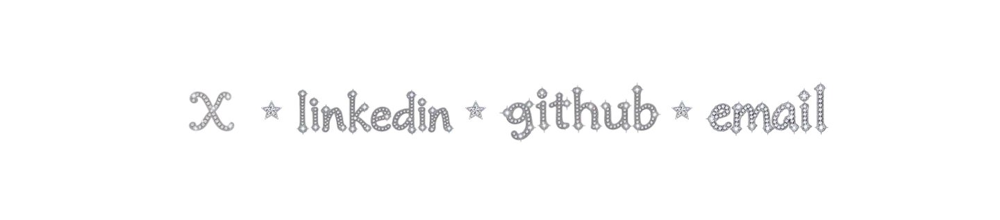

# Silver gem footer

The footer has four linked word images and three decorative stars. Each record in `siteContent.footer.links` owns its destination, image path, and native dimensions. The renderer inserts the shared star between adjacent links.

The word images use the silver rhinestone material and lowercase calligraphic serif lettering from `public/brand/subtitle-sparkle.png`. `public/brand/name-sparkle.png` supplied the second material reference. The assets were generated with the built-in imagegen tool. All five PNGs have real transparency.

## Artwork prompts

Generate each word separately with this prompt, substituting `x`, `linkedin`, `github`, or `email`.

> Create a production website footer asset containing only the exact lowercase word on a genuinely transparent background. Match the reference's lowercase calligraphic serif typeface, softly irregular curved letter shapes, silver-gray strokes, small round clear diamond rhinestones, white starburst glints, and subtle icy blue reflections. Keep one readable word on one line. No colored jewels, gold, extra symbols, backdrop, or painted checkerboard. Preserve the complete lettering and sparkles.

Use this prompt for the shared separator.

> Create one five-pointed silver faceted star gemstone. Match the reference lettering's silvery white rhinestone material and glints. Use dimensional triangular crystal facets, a thin silver setting, white highlights, and subtle cool blue reflections. Front view, top point upward. No lettering, extra stars, colored jewels, backdrop, or painted checkerboard. Output genuine transparency.

Background extraction passes removed opaque backgrounds from the email and star outputs. A new X generation used the subtitle alone as its reference to obtain transparent silver lettering without the first attempt's checkerboard. Keep the original alpha channels when replacing or exporting these assets.

## Verify the footer

Use an isolated checkout and an unused port. Start the production app in one terminal.

```sh
npm ci
npm run build
npm run start -- -H 127.0.0.1 -p 42871
```

The browser verifier requires Python Playwright and Chromium. Run it in a second terminal.

```sh
python3 -m pip install playwright
python3 -m playwright install chromium
python3 scripts/verify-footer.py --url http://127.0.0.1:42871 --evidence-dir /tmp/syd-footer-evidence
```

The check covers four distinct loaded word images, unchanged destinations, three stars outside every link rectangle, pointer hit targets, 44 pixel minimum targets, keyboard focus, and outbound browser requests. It captures the actual page at 320, 390, 768, and 1440 pixels. It intercepts external requests and does not open the email application. It verifies this site's handoff, not third-party page content.

The baseline fails with `FAIL: x must contain one word image`. The corrected footer passes the same check.

## Browser evidence

Desktop at 1440 pixels.



Phone at 390 pixels.


